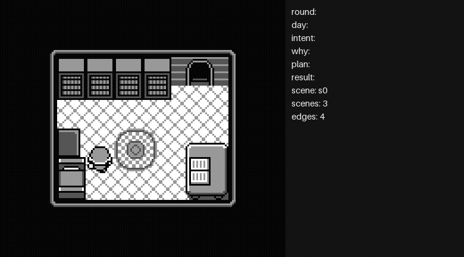

# gameboy-llm-agent


-000000)


**Can a small language model play a Game Boy game — with no vision model, seeing
the world only by reading the emulator's memory?**

This is a hands-on learning project about building LLM agents from scratch. The
agent plays **Deadeus**, a free, open-source Game Boy horror game (a boy has three
in-game days to prevent a catastrophe and reach one of the eleven possible endings). It perceives the world model-free — RAM
and the tilemap, no screenshots into a vision model — and an LLM makes the
judgement calls, through a swappable backend (local Ollama, or a cloud
OpenAI-compatible endpoint — the reference setup uses Groq's free tier with
`openai/gpt-oss-20b`, since a 3B local model is painfully slow per call). The
project started as a Pokémon Red idea and pivoted to Deadeus, which is legal to
redistribute, so the whole thing can be open-sourced — the same RAM- and
tilemap-reading techniques apply to either game.



*10 rounds against Groq's `gpt-oss-20b`: reads the room's landmarks, discovers the
save mechanic, crosses into the next room, and picks up a lead ("check on the girl
next door") — with the LLM's own intent, reasoning ("why"), and running plan
overlaid per round. Recorded with [`scripts/record_demo.py`](scripts/record_demo.py).*

## The one idea worth taking away: reflexes vs. judgement

The hard-won principle the whole project is built on:

> **Deterministic code does the reflexes; the LLM only makes judgement calls.**

Pathing to a tile, sweeping a wall for a door, clicking through the intro — these
are *reflexes*. Small models do them badly (see the design log for the A/B test
where two different 3B models made the identical spatial mistake). So they live in
plain, reliable code. The LLM is spent only where judgement is actually needed:
*where* to go, *which* exit, *what* a line of dialogue means, *which* ending to aim
for. Watching the agent makes the boundary obvious — and finding it is most of the
work.

## What it can do today

- **See, without a vision model.** Player position straight from RAM
  (`0xC008/0xC009`), and on-screen text decoded from the tilemap by hashing each
  glyph's 8×8 bitmap against a ROM-derived font table — a deterministic mini-OCR,
  no model. (`src/perception.py`)
- **Reach the game on its own.** It clicks through Deadeus's long, partly
  unskippable intro by pressing A while a dialog is on screen, and confirms it has
  real control with a *reversible* movement test. (`skip_intro`)
- **Navigate a room reliably, indoors and outdoors.** Deterministic tile-by-tile
  movement, plus a mini-map the agent builds from its own moves (floor where it has
  walked, walls where a move was blocked) fed into the planner's prompt. Crossing
  between screens — the hard part — is bound to the exact button-press that caused
  it by a settle-based `step()` primitive, so a delayed screen transition can no
  longer get misattributed to a later, unrelated press (this was the root cause
  behind a family of self-loops and wrong-direction edges — see the design log).
  (`src/navigation.py`, `src/roommap.py`, `src/crossing.py`)
- **Know what day it is.** Reads the real in-game day counter straight from RAM and
  surfaces "day N of 3" to the planner, so the LLM can reason about its shrinking
  time budget — nothing prescribes *whether* to act on it; that's left to the LLM
  to self-regulate.
- **Never make an irreversible choice by accident.** Yes/No prompts (sleeping) and
  the save book's Save/Cancel prompt are both auto-declined, so the agent can bump
  into a bed or a save point while exploring without ending the day or overwriting
  a save.
- **Route across more than one room.** `go_to` does a BFS over the map graph, so
  the LLM can name a destination two or three rooms away and the agent finds its
  own way there.
- **Remember.** A Markdown notebook (`world.md`) the agent writes as it plays:
  scenes are identified by a per-room *fingerprint* (a hash of the full background
  tilemap) and connected into a map. Writing is split — code records what it
  *measures*, the LLM records what it *interprets*. (`src/memory.py`)
- **Be watched.** `--watch` opens a live window: the upscaled game screen next to
  an overlay of what the agent perceives and decides. (`src/viewer.py`)

Current focus: getting from "explore, map, and navigate reliably" to "read every
NPC and pursue a goal (reach a non-violent ending)." Status and the full
blow-by-blow are in the design log.

## Status — what works, what doesn't

This is an honest work-in-progress, not a finished product. The value is the
*architecture and the investigation*, not a bot that beats the game.

**Works (verified by the test suite — 22 tests pass: 5 emulator-free, 17 against
the ROM):**
- Model-free perception: player position, on-screen text (ROM-font OCR), dialog
  state, per-scene fingerprint, and the in-game day counter.
- Deterministic skills: `walk_to`, edge-sweep door-finding, `interact`, full-room
  exploration without bouncing out the first door, reverse-crossing (with a
  self-correcting map), and **safety** on both consequential menus (sleep, save)
  — the agent never auto-confirms them.
- Clean map notebook: multi-tile objects de-dupe to one landmark, and typewriter
  overlap in captured dialogue is merged out (no more "you can you can save").
- **Breaks out of the house and navigates outdoors cleanly.** One `explore` intent
  maps a room to completion and follows its far exits, so the agent gets from the
  bedroom through the living room, out into the **town**, and on to further outdoor
  areas (e.g. Urizen Falls) with no self-loops or ping-ponging — the crossing
  detection that used to break on scrolling/flickering outdoor screens is now
  correct in both directions (verified deterministically, e.g.
  `test_no_town_selfloops`, `test_leave_falls`).
- Day-awareness and cross-room BFS routing (above), and the intent loop end-to-end:
  the LLM picks `explore` / `go_to` / `interact` / `remember`, a deterministic skill
  runs it, and a persistent map notebook grows.
- A swappable LLM backend (local Ollama ↔ any OpenAI-compatible cloud), with
  proactive token-budget pacing so a run stays under Groq's free-tier rate limit
  instead of hitting repeated 429s.

**Not working yet / open problems:**
- **The headline finding: a 3B–20B model is the weak link.** The deterministic
  scaffolding does the heavy lifting; small models plan repetitively and reason
  poorly about space. Getting the boundary right (reflex vs. judgement) *is* the
  project — see the design log's A/B tests.
- **Goal-directed routing can loop.** `go_to`'s BFS routing reliably *crosses*
  rooms — the mechanics above are solid — but the LLM's own choice of target
  isn't: once a lead names someone/something it can't yet resolve, the agent can
  revisit the same two or three rooms indefinitely with no new information, since
  nothing tracks "already checked here for this lead." Seen over multiple live
  15–20 round runs.
- **One remaining unguarded call site.** `walk_to()`, used while approaching a
  recorded door before the crossing-aware fast path runs, isn't itself
  crossing-aware — a bad/guessed door coordinate could in principle let it walk
  through a real boundary uncredited. Same bug class as the crossing-attribution
  fix above, just not yet routed through it. Flagged, not exploited in any test.
- The game is **not** played to an ending yet; there's no ending-detection or
  bloodiness-ranking logic built. Progress currently stops at reliable multi-area
  navigation and dialogue collection.

## The design log

**[`docs/design-log.md`](docs/design-log.md)** is a chronological record of every
decision *and every dead-end* — the local vision model that was too slow, the RAM
addresses that turned out to be noise, the LLM that walked onto the exit tile and
never stepped through. Nothing is rewritten to look clever in hindsight. If you
only read one file to understand the project, read that one.

## Quickstart

```bash
conda env create -f environment.yml
conda activate gameboy-agents
```

**ROM:** ⚠️ not included, and never will be. Download the free **Deadeus** ROM from
the developer (<https://izma.itch.io/deadeus>) and put it at `roms/Deadeus.gb`.

**LLM backend** — recommended: a free Groq API key (cloud, fast). Copy
`.env.example` to `.env` and fill in `OPENAI_API_KEY`; it's already pointed at
`https://api.groq.com/openai/v1` with `openai/gpt-oss-20b`. Alternatively, set
`LLM_BACKEND=ollama` in `.env` and pull a model locally with
[Ollama](https://ollama.com/) (`ollama pull llama3.2:3b`) — works fully offline,
but a 3B local model on CPU is **very slow (~1–2 min per decision)**.

Run from the repo root:

```bash
python src/agent.py          # headless
python src/agent.py --watch  # with the live viewer
```

## Project layout

```
gameboy-llm-agent/
├── src/               # the application
│   ├── perception.py    # the "eye": position + text from RAM/tilemap; scene fingerprint
│   ├── navigation.py    # deterministic controller: walk_to / step / search_for_exit / menus
│   ├── roommap.py       # local occupancy mini-map, built from the agent's own moves
│   ├── crossing.py      # is_crossing_move: real screen crossing vs. a scroll/flicker tick
│   ├── dialog.py        # merge_dialog: cleans up typewriter-overlap in captured text
│   ├── memory.py        # the notebook: WorldMap (scenes + connections), saved to world.md
│   ├── llm.py           # swappable LLM backend (Ollama / any OpenAI-compatible cloud)
│   ├── viewer.py        # optional live window (--watch): game screen + perception/decision overlay
│   ├── agent.py         # the loop: LLM intent planner + deterministic skills
│   └── deadeus_font.json # {glyph-hash: char}, all 95 printable ASCII (ROM-derived)
├── tests/             # smoke/capability tests: prove one thing each (some need the ROM)
├── exploration/       # the "workshop": one-off reverse-engineering probes (see the log)
├── docs/
│   └── design-log.md    # the chronological decision + dead-end log
├── environment.yml
└── roms/              # your own ROM goes here (git-ignored)
```

## License

Code released under the [MIT License](LICENSE). The Deadeus ROM is **not** part of
this repository and is not covered by this license — obtain it from the developer
at <https://izma.itch.io/deadeus>.
